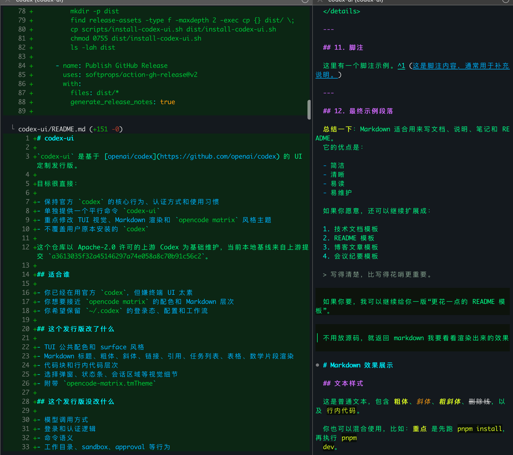

# codex-ui

[English README](./README.en.md)


`codex-ui` 是基于 [openai/codex](https://github.com/openai/codex) 的 UI 定制发行版，目标是尽量保持官方 `codex` 的使用方式不变，只增强终端中的视觉层次、Markdown 渲染和 `matrix` 风格主题。

当前 GitHub 仓库实际地址是：

- [orime/codex-ui](https://github.com/orime/codex-ui)

本地命令保持为：

- `codex-ui`

## 项目定位

- 保持官方 `codex` 的核心行为、认证方式和使用习惯
- 提供一个平行命令 `codex-ui`
- 强化 TUI 配色、Markdown 层次、表格、任务列表、代码块和引用块样式
- 附带 `opencode-matrix.tmTheme`
- 不覆盖用户原本安装的 `codex`

当前本地基线来自上游提交：

- `a3613035f32a45146297a74e058a8c70b91c56c2`

## 效果示例

下面这张图是当前仓库使用的 `matrix` 风格预览图：



这套 UI 重点强化的是：

- 青色标题和列表结构
- 黄色粗体强调
- 橙色斜体和暖色行内强调
- 深色代码块和更明显的块级层次
- 更接近 `opencode matrix` 的整体观感

## 适合谁

- 你已经在用官方 `codex`，但觉得默认 TUI 太素
- 你想要更接近 `opencode matrix` 的视觉风格
- 你希望继续使用原有的 `~/.codex` 配置、会话和认证信息

## 改了什么

- TUI 公共配色和 surface 风格
- Markdown 标题、粗体、斜体、链接、引用、任务列表、表格、数学片段渲染
- 代码块和行内代码层次
- 选择弹窗、状态条、会话区域等视觉细节
- 主题资产 `opencode-matrix.tmTheme`

## 没改什么

- 模型调用方式
- 登录和认证逻辑
- 命令语义
- 工作目录、sandbox、approval 等行为

一句话说就是：

- `codex` 是官方原版
- `codex-ui` 是 UI 强化版

## 安装

### 一键安装

```sh
curl -fsSL https://raw.githubusercontent.com/orime/codex-ui/main/scripts/install-codex-ui.sh | sh
```

默认会做这些事：

- 下载当前平台对应的 Release 包
- 安装 `codex-ui` 和 `codex-ui-bin` 到 `~/.local/bin`
- 安装 `opencode-matrix.tmTheme` 到 `~/.codex/themes`
- 不覆盖已有的 `codex`

安装完成后直接运行：

```sh
codex-ui
```

### 手动安装

从 [Releases](https://github.com/orime/codex-ui/releases) 下载对应平台压缩包，解压后会得到：

- `codex-ui`
- `codex-ui-bin`
- `opencode-matrix.tmTheme`

把：

- `codex-ui`
- `codex-ui-bin`

放进你的 `PATH` 目录，把：

- `opencode-matrix.tmTheme`

放到 `~/.codex/themes/` 即可。

## 工作方式

`codex-ui` 是一个很薄的包装命令。它会：

- 调起同目录下的 `codex-ui-bin`
- 自动附带 `-c 'tui.theme="opencode-matrix"'`

所以你不需要手动改 `~/.codex/config.toml` 才能使用这套主题。

你现有的：

- `~/.codex/auth.json`
- `~/.codex/config.toml`
- `~/.codex/sessions`

都会继续复用。

## 平台支持

当前 Release workflow 默认构建这些目标：

- `aarch64-apple-darwin`
- `x86_64-apple-darwin`
- `x86_64-unknown-linux-musl`

如果后续需要，可以再补：

- `aarch64-unknown-linux-musl`

## Release 现状

仓库里已经有自动发布 workflow：

- [codex-ui-release.yml](./.github/workflows/codex-ui-release.yml)

它会在 push tag 时自动构建并发布这些资产：

- `codex-ui-aarch64-apple-darwin.tar.gz`
- `codex-ui-x86_64-apple-darwin.tar.gz`
- `codex-ui-x86_64-unknown-linux-musl.tar.gz`
- 对应的 `.sha256`
- 安装脚本 `install-codex-ui.sh`

如果你现在看不到 Release，通常是这几种原因：

1. 还没有打 tag 并推送
2. 仓库的 GitHub Actions 还没启用
3. 最初推送 workflow 文件时使用的 token 没有 `workflow` 权限

最短启用步骤：

```sh
cd /Users/orime/codex-ui
git tag v0.114.0-ui.1
git push origin v0.114.0-ui.1
```

如果 tag push 后没有触发 workflow，请检查：

- 仓库 `Actions` 是否启用
- 你推送 workflow 文件时是否使用了 SSH，或者使用了带 `workflow` 权限的 PAT

如果你用 PAT 推送包含 `.github/workflows/*` 的提交，token 需要额外具备能更新 workflow 的权限。否则 GitHub 会拒绝 push。

## 本地构建

```sh
git clone https://github.com/orime/codex-ui.git
cd codex-ui
cargo +stable build --manifest-path codex-rs/Cargo.toml --release --bin codex
```

构建完成后可以执行：

```sh
./scripts/package-codex-ui-release.sh aarch64-apple-darwin dist
```

它会把二进制重新封装成 Release 产物格式。

## 发布流程

1. 从上游 `openai/codex` 同步最新代码
2. 合入本仓库的 UI 改动
3. 打 tag，例如 `v0.114.0-ui.1`
4. 推送 tag
5. GitHub Actions 自动构建并发布 Release

## 有助于 GitHub 检索的关键词

这个仓库主要覆盖这些关键词：

- OpenAI Codex
- Codex CLI
- terminal UI
- Rust TUI
- opencode-inspired theme
- matrix theme
- markdown rendering
- codex theme

## 维护建议

- 保持 `codex-ui` 作为独立命令，不要覆盖系统里的 `codex`
- 尽量把改动限制在 `codex-rs/tui` 和主题资产
- 版本号跟随上游，例如 `v0.114.0-ui.1`

## 许可与归属

本仓库基于 OpenAI 开源的 Codex 仓库修改而来，遵循 Apache-2.0。

- 上游项目：[openai/codex](https://github.com/openai/codex)
- 本仓库保留原始 [LICENSE](./LICENSE) 与 [NOTICE](./NOTICE)
